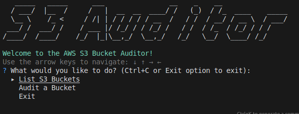
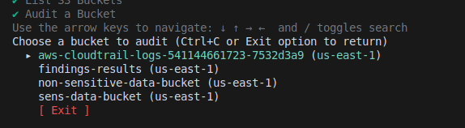
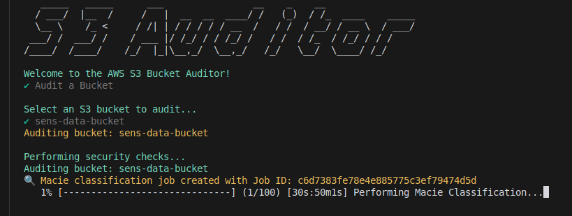
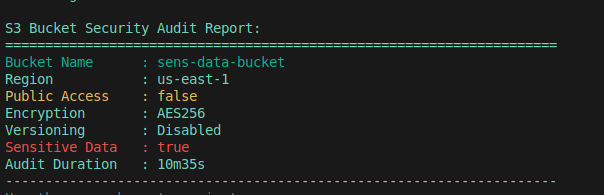

# AWS S3 Bucket Auditor with AI Integration

The **AWS S3 Bucket Auditor** is a Go-based command-line tool that performs a comprehensive security audit of your Amazon S3 buckets. It integrates with AWS Macie to check for sensitive data, providing intelligent insights while ensuring data privacy and security.

For a short overview of the repository structure, see [docs/EXPLAIN.md](docs/EXPLAIN.md).






## Features

- 🔍 **List Buckets**: Displays all S3 buckets in your AWS account.
- 🔒 **Public Access Check**: Flags buckets that are publicly accessible.
- 🔐 **Encryption Status**: Indicates whether server-side encryption is enabled.
- 🔄 **Versioning Status**: Shows if versioning is enabled or disabled.
- 🕵️ **Sensitive Data Detection**: Uses AWS Macie to identify buckets that may contain sensitive data.
- 📊 **Comprehensive Report**: Generates a detailed audit report for security reviews.

## Why Use This Tool Instead of AWS CLI?

While the AWS CLI is powerful, this tool simplifies and automates multiple security checks into a single, easy-to-use application:

- 🤖 **Automated Multi-Check Auditing**: Consolidates multiple AWS CLI commands into one automated process.
- 🧠 **AI-Powered Insights**: Integrates with AWS Macie for intelligent detection of sensitive data.
- 📄 **Simplified Output**: Provides a clean, organized report that's easy to interpret.
- ⚡ **Concurrency for Speed**: Uses Go's concurrency to perform checks faster than sequential AWS CLI commands.
- 👤 **User-Friendly**: No need to remember complex AWS CLI commands or parameters.
- 🛠️ **Customizable**: Open-source and written in Go, allowing for easy customization and extension.

## Prerequisites

- **Go**: Version 1.16 or higher installed on your system.
- **AWS Account**: An active AWS account with AWS Macie enabled.
- **AWS Credentials**: Configured AWS credentials with the necessary permissions.
- **AWS Charges**: Be aware that using AWS Macie may incur additional charges.

## Installation

1. **Clone the repository:**

    ```bash
    git clone https://github.com/yourusername/aws-s3-bucket-auditor.git
    ```

2. **Navigate to the project directory:**

    ```bash
    cd aws-s3-bucket-auditor
    ```

3. **Download dependencies:**

    ```bash
    go mod tidy
    ```

## Configuration

Ensure that your AWS credentials are properly configured. The AWS SDK for Go will look for credentials in the following order:

1. **Environment variables:**
    - AWS_ACCESS_KEY_ID
    - AWS_SECRET_ACCESS_KEY
    - AWS_REGION

2. **Shared Credentials File (~/.aws/credentials):**

    Configure your credentials using the AWS CLI or by manually editing the credentials file.

    ```ini
    [default]
    aws_access_key_id = YOUR_ACCESS_KEY_ID
    aws_secret_access_key = YOUR_SECRET_ACCESS_KEY
    ```

3. **Shared Configuration File (~/.aws/config):**

    You can also set the default region in the configuration file.

    ```ini
    [default]
    region = us-east-1
    ```

## Permissions Setup for Macie

First of all make sure that Amazon Macie is enabled in your AWS account.

### S3 Bucket Policy for Findings Bucket

Ensure the S3 bucket used by Macie for storing findings has the following policy:

```json
{
    "Version": "2012-10-17",
    "Statement": [
        {
            "Sid": "AllowMacieToStoreFindings",
            "Effect": "Allow",
            "Principal": {
                "Service": "macie.amazonaws.com"
            },
            "Action": "s3:PutObject",
            "Resource": "arn:aws:s3:::findings-results/*",
            "Condition": {
                "StringEquals": {
                    "aws:SourceAccount": "YOUR_ACCOUNT_ID"
                }
            }
        },
        {
            "Sid": "AllowMacieToUseGetBucketLocation",
            "Effect": "Allow",
            "Principal": {
                "Service": "macie.amazonaws.com"
            },
            "Action": "s3:GetBucketLocation",
            "Resource": "arn:aws:s3:::findings-results"
        }
    ]
}
```

### KMS Policy for Findings Bucket Encryption

Ensure the KMS key used for encrypting Macie findings has the following policy:

```json
{
    "Version": "2012-10-17",
    "Statement": [
        {
            "Sid": "AllowMacieToUseTheKey",
            "Effect": "Allow",
            "Principal": {
                "Service": "macie.amazonaws.com"
            },
            "Action": [
                "kms:GenerateDataKey",
                "kms:Encrypt"
            ],
            "Resource": "*",
            "Condition": {
                "StringEquals": {
                    "aws:SourceAccount": "YOUR_ACCOUNT_ID"
                }
            }
        }
    ]
}
```

### Permissions

The tool requires the following AWS IAM permissions:

- S3: ListBuckets, GetBucketLocation, GetBucketAcl, GetBucketEncryption, GetBucketVersioning, GetPublicAccessBlock
- Macie: Permissions to initiate classification jobs and access findings

## Usage

Build the application:

```bash
go build -o s3auditor main.go
```

Run the application:

```bash
./s3auditor
```

Sample output:

```yaml
S3 Bucket Security Audit Report:
=====================================================================
Bucket Name      : my-first-bucket
Region           : us-east-1
Public Access    : false
Encryption       : AES256
Versioning       : Enabled
Sensitive Data   : false
---------------------------------------------------------------------
Bucket Name      : public-bucket
Region           : us-west-2
Public Access    : true
Encryption       : Not Enabled
Versioning       : Disabled
Sensitive Data   : true
---------------------------------------------------------------------
```

## How to Support

If you find this tool useful and would like to support further development, you can:

[](https://www.buymeacoffee.com/techmarko)

Your support is greatly appreciated!

## 📫 How to reach me

  [](mailto:ddjura87@gmail.com)
  [](https://www.linkedin.com/in/markodurasic/)
  [](https://www.markodurasic.com/)
  [](https://linktr.ee/techmarko)

## Contributing

Contributions are welcome! Please feel free to submit a pull request or open an issue.

## License

This project is licensed under the MIT License - see the LICENSE file for details.

## Security Considerations

- 🔑 API Keys: Ensure your AWS credentials are securely stored and not hardcoded.
- 📜 Compliance: Designed to help with compliance standards like GDPR and HIPAA by identifying buckets that may contain sensitive data.

## Additional Notes

### AWS Macie Integration

- 💰 AWS Charges: Using AWS Macie may incur additional costs. Please refer to the AWS Macie Pricing page for details.

## Customization

Feel free to customize and extend the tool:

- ➕ Add More Checks: Incorporate additional security checks as needed.
- 🔄 Integrate Other Services: Connect with other AWS services like GuardDuty for enhanced security.
- 📊 Improve Reporting: Enhance the output format or generate reports in different file formats.

## Why This Tool is Unique

- 🤖 **AI-Powered Security**: Integrates with AWS Macie to provide intelligent insights about sensitive data.
- 🧪 **Comprehensive Auditing**: Can be extended to perform multiple security checks in a single run.
- ⚡ **Performance Optimized**: Uses concurrency for efficient processing.
- 📖 **Open Source**: Allows the community to contribute and improve the tool.
- 🎓 **Educational Value**: Serves as a practical example of integrating AWS services using Go.
- 🖥️ **CLI**: Provides a user-friendly CLI for easy interaction. For geeky people like me, who prefer CLI over GUI.


## Additional Information

- Additional screenshots:
  - [Bucket Details](docs/images/other/Bucket_Details.png)
  - [Bucket List](docs/images/other/Bucket_List.png)

## Testing

### Unit Tests
To run only unit tests:
```bash
go test ./internal/... -v
```

### Integration Tests
Note: Integration tests can take 15-30 minutes to complete due to Macie classification jobs. Use the -short flag to skip long-running tests:
```bash
# Run with extended timeout
./tests/scripts/run_integration_tests.sh

# Skip long-running tests
go test ./test/integration/... -v -short
```

### All Tests
To run all tests:
```bash
# Run all tests (including integration tests)
go test ./... -v -timeout 30m

# Run all tests except integration tests
go test ./... -v -short
```

Note: Running all tests includes integration tests which:
- Require valid AWS credentials
- Can take 15-30 minutes to complete
- Will create and delete test resources in your AWS account
- May incur AWS costs (especially from Macie)